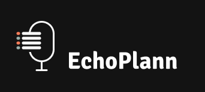

<a id="readme-top"></a>

<!-- PROJECT SHIELDS NEED TO BE ADDED AFTERWARD
[![Contributors][contributors-shield]][contributors-url]
[![Forks][forks-shield]][forks-url]
[![Stargazers][stars-shield]][stars-url]
[![Issues][issues-shield]][issues-url]
[![MIT License][license-shield]][license-url]
[![LinkedIn][linkedin-shield]][linkedin-url]
-- >

<!-- PROJECT LOGO -->
<br />
<div align="center">
  <a href="https://github.com/Cosmeak/echoplann-backend">
    
  </a>

<h3 align="center">EchoPlann</h3>

  <p align="center">
    Let your EchoPlann do it for you
    <br />
    <a href="https://github.com/github_username/repo_name"><strong>Explore the docs »</strong></a>
    <br />
  </p>
</div>


<!-- TABLE OF CONTENTS -->
<details>
  <summary>Table of Contents</summary>
  <ol>
    <li>
      <a href="#about-the-project">About The Project</a>
      <ul>
        <li><a href="#built-with">Built With</a></li>
      </ul>
    </li>
    <li>
      <a href="#getting-started">Getting Started</a>
      <ul>
        <li><a href="#prerequisites">Prerequisites</a></li>
        <li><a href="#installation">Installation</a></li>
      </ul>
    </li>
    <li><a href="#usage">Usage</a></li>
    <li><a href="#contributors">Contributors</a></li>
  </ol>
</details>


<!-- ABOUT THE PROJECT -->
## About The Project

This project is a simple implementation of a REST API using Symfony API Platform Framework. The API is used to manage your calendar with some integrated AI.
This is the backend for the Master 2 project at IIM Digital School Paris.

<p align="right">(<a href="#readme-top">back to top</a>)</p>


### Built With

* [![Symfony][Symfony.com]][https://symfony.com/doc/current/index.html]
* [![Symfony API Platform][api-platform.com]][https://api-platform.com/]
* [![Docker][Docker.com]][https://www.docker.com/]

<p align="right">(<a href="#readme-top">back to top</a>)</p>


<!-- GETTING STARTED -->
## Getting Started

This project is made with Symfony and Symfony API Platform. It is a simple API that allows you to create, read, update and delete some data.

### Prerequisites

This is an example of how to list things you need to use the software and how to install them.
* Docker Desktop
  ```sh
  https://www.docker.com/products/docker-desktop/
  ```

or :

* Orbstack
  ```sh
    https://orbstack.dev/
  ```

### Installation

1. Clone the repo

   ```sh
   git clone git@github.com:Cosmeak/echoplann-backend.git
   ```

2. Launch Docker

First of all, you need to launch your Docker Desktop app or your Orbstack app.
   ```sh
   docker-compose up --build -d
   ```

3. Create the database and play the migrations

Enter in the symfony container :
    ```sh
    docker exec -it symfony /bin/bash
    ```

Create the database :
    ```sh
    bin/console doctrine:database:create
    ```

Play the migrations :
    ```sh
    bin/console doctrine:migrations:migrate
    ```

4. Enter your API in `http://127.0.0.1:8000/`

Go to : http://127.0.0.1:8000/
or change the port to : 8080

5. Load the fixtures

    ```sh
    bin/console doctrine:fixtures:load
    ```

<p align="right">(<a href="#readme-top">back to top</a>)</p>


<!-- USAGE EXAMPLES -->
## Usage

Use the URL to see the API Contract

<p align="right">(<a href="#readme-top">back to top</a>)</p>


<!-- CONTRIBUTORS -->
## Contributors

<table>
<tr>
    <td align="center" style="word-wrap: break-word; width: 150.0; height: 150.0">
        <a href="https://github.com/yannisobert">
            
            <br />
            <sub style="font-size:14px"><b>Yannis Obert</b></sub>
        </a>
    </td>
    <td align="center" style="word-wrap: break-word; width: 150.0; height: 150.0">
        <a href="https://github.com/SorenMesselier-Sentis">
            
            <br />
            <sub style="font-size:14px"><b>Soren Messelier-Sentis</b></sub>
        </a>
    </td>
    <td align="center" style="word-wrap: break-word; width: 150.0; height: 150.0">
        <a href="https://github.com/Cosmeak">
            
            <br />
            <sub style="font-size:14px"><b>Guillaume Fine</b></sub>
        </a>
    </td>
</tr>
</table>

<p align="right">(<a href="#readme-top">back to top</a>)</p>
